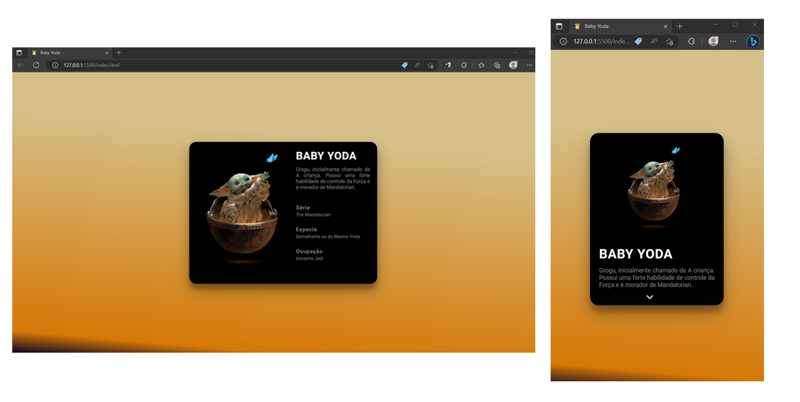

<h1 align="center">Card Personagem Star Wars</h1>

O #boraCodar é um evento exclusivo e gratuito, promovido pela Rocketseat para ensino de tecnologias WEB. Onde toda semana é lançado um novo projeto, para te desafiar a evoluir suas técnicas. 

  <a href="#-tecnologias">Tecnologias</a>&nbsp;&nbsp;&nbsp;|&nbsp;&nbsp;&nbsp;
  <a href="#-projeto">Projeto</a>&nbsp;&nbsp;&nbsp;|&nbsp;&nbsp;&nbsp;
  <a href="#-layout">Layout</a>&nbsp;&nbsp;&nbsp;|&nbsp;&nbsp;&nbsp;
  <a href="#memo-licença">Licença</a>

  

 

  

 

## 🚀 Tecnologias

Esse projeto foi desenvolvido com as seguintes tecnologias:

- HTML
- CSS
- Javascript

 
## 💻 Projeto

Desenvolver um card de personagem de Star Wars, em homenagem ao May the 4h. Escolhi desenvolver um card do Baby Yoda, que tem seu aparecimento na Série Mandalorian. Foi criado um card simples para versão desktop e para versão mobile utilizei javascript, para mostrar e esconder os dados do personagem.

- [Visite o projeto](https://wilkasantos.github.io/desafio-BoraCodar-CardPersonagemStarWars/)

 
## 🔖 Layout

O layout do projeto proposto encontra-se no Figma e você pode ter acesso através [DESSE LINK](https://www.figma.com/community/file/1235589928611910732/%23boraCodar---Desafio-18).

 
## 🔒 Layout

Esse projeto está sob a licença MIT.
